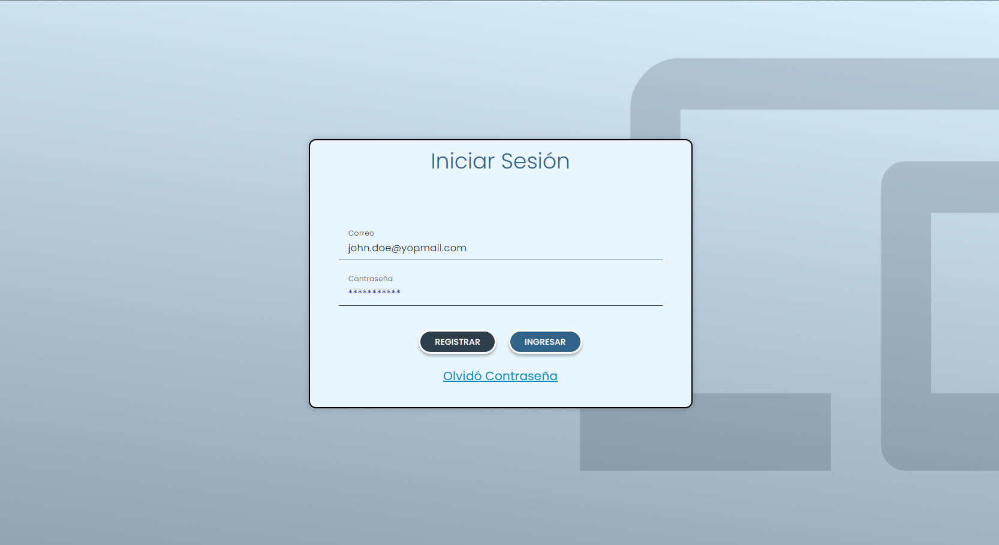
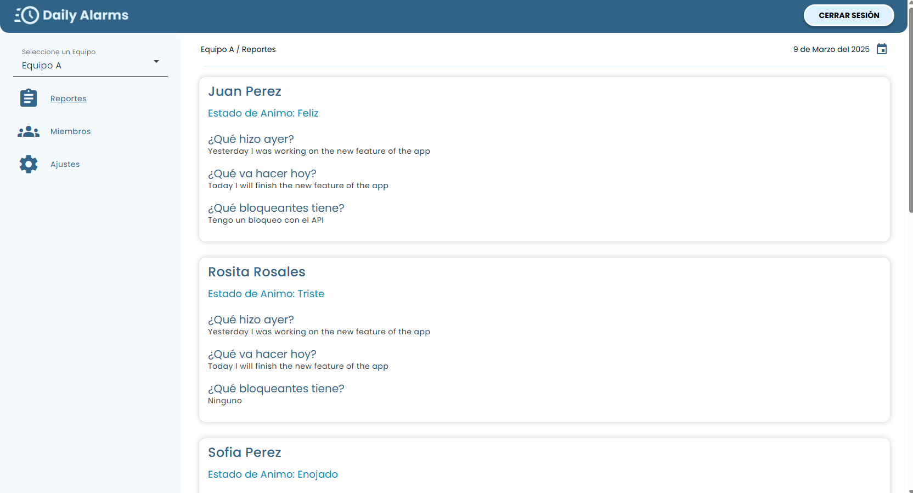
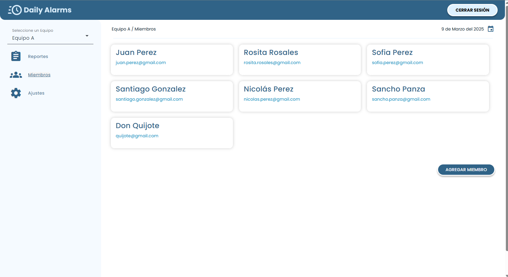
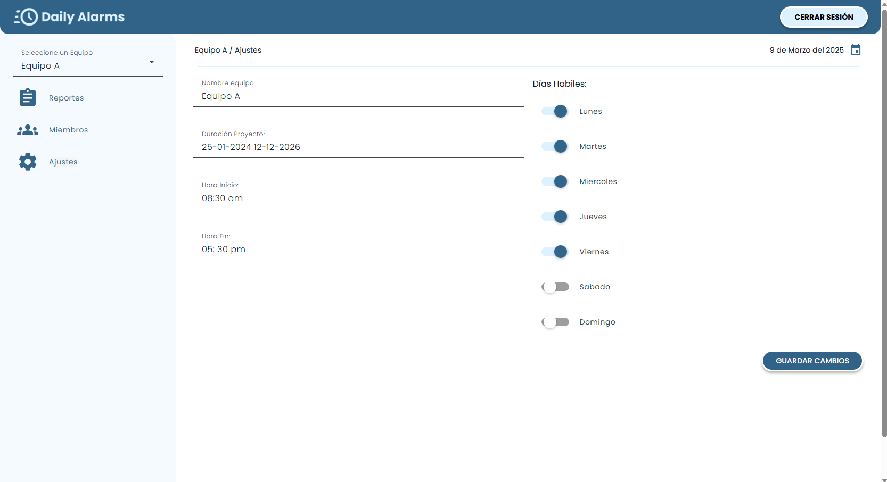

# DailyAlarms

<a alt="Nx logo" target="_blank" rel="noreferrer"></a>


 Este proyecto es una aplicación Angular que incluye varios módulos como core, dashboard, login, settings y users.

## Estructura del Proyecto

La estructura del proyecto es la siguiente:

```
.editorconfig
.gitignore
.npmrc
.prettierignore
.prettierrc
eslint.config.mjs
nx.json
package.json
pnpm-lock.yaml
README.md
tsconfig.base.json
.angular/
.cache/
.nx/
.vscode/
apps/
  core/
  dashboard/
  login/
  settings/
  users/
```

### Descripción de Carpetas

- **.angular/**: Configuración específica de Angular.
- **.cache/**: Archivos de caché.
- **.nx/**: Configuración y caché de Nx.
- **.vscode/**: Configuración específica de Visual Studio Code.
- **apps/**: Contiene los diferentes módulos de la aplicación:
  - **core/**: Módulo principal de la aplicación.
  - **dashboard/**: Módulo del panel de control.
  - **login/**: Módulo de autenticación.
  - **settings/**: Módulo de configuración.
  - **users/**: Módulo de gestión de usuarios.

## Instalación

Para instalar las dependencias del proyecto, ejecuta el siguiente comando:

```sh
pnpm install
```

## Ejecución del Proyecto

Para ejecutar el proyecto en modo desarrollo, utiliza el siguiente comando:

```sh
pnpm serve
```

Esto iniciará un servidor de desarrollo y podrás visualizar la aplicación en tu navegador en `http://localhost:4200`.

## Construcción del Proyecto

Para construir el proyecto para producción, utiliza el siguiente comando:

```sh
pnpm build
```

Los archivos construidos se encontrarán en la carpeta `dist/`.

 ## Vistas Configuradas


 - Login
    Ruta: http://localhost:4200/login

    <a alt="Login" target="_blank" rel="noreferrer"></a>

- Dashboard (Registros Equipos)
    Ruta: http://localhost:4200/dashboard/daily

<a alt="Login" target="_blank" rel="noreferrer"></a>

- Dashboard (Miembros)
    Ruta: http://localhost:4200/dashboard/users

    <a alt="Login" target="_blank" rel="noreferrer"></a>


- Dashboard (Ajustes)
    Ruta: http://localhost:4200/dashboard/settings

<a alt="Login" target="_blank" rel="noreferrer"></a>

 ## Autor

- [Nicolás Potier](https://github.com/nipoanz)